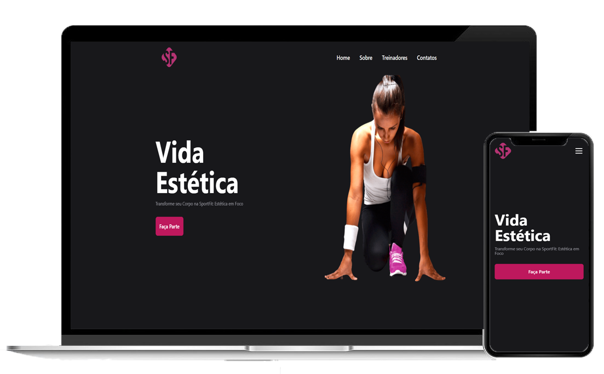

<h1 align="center">SportFit</h1>

## 🔖Preview
<div align="center">
	
</div>
  
## 📜 Sobre
Projeto para aprender e praticar React Js, TypeScript, Next Js, Tailwind Css e outras Tecnologias.

Simula uma LandingPage para uma acadêmia ficticia.

## 🚀 Tecnologias
### Frontend:
- React
- Next Js
- Tailwind Css
- TypeScript

## 💻 Iniciando o Projeto Localmente


### Requisitos

**Clone o Projeto e acesse o Diretório**

```bash
$ git clone https://github.com/andreydantasvf/SportFit && cd SportFit
```

**Para iniciar a aplicação web:**
```bash
$ npm install
```
```bash
$ npm run dev
```